# 데이터베이스 (Database) 문서

## 개요

Newsround1 프로젝트의 데이터베이스는 **MySQL 호환 TiDB Cloud**를 사용하며, 뉴스 큐레이션, 토픽 투표, 실시간 채팅, 댓글 시스템 등의 데이터를 관리합니다. `utf8mb4` 캐릭터셋을 사용하여 다국어 및 이모지를 지원하며, 외래 키(Foreign Key) 제약을 통해 데이터 무결성을 보장합니다.

### 주요 특징

- **DBMS**: TiDB Cloud (MySQL 8.0 호환)
- **캐릭터셋**: `utf8mb4_unicode_ci` (한글, 이모지 지원)
- **관계형 설계**: 외래 키 제약을 통한 데이터 무결성 유지
- **인덱스 최적화**: 조회 성능을 위한 복합 인덱스 설계
- **벡터 검색**: `embedding` 컬럼을 활용한 기사 유사도 분석

## 테이블 명세

### 1. 사용자 관리 (User Management)

#### `tn_user`

사용자 계정 정보를 저장하는 핵심 테이블입니다.

| 컬럼명              | 타입          | 제약                      | 설명                                   |
| ------------------- | ------------- | ------------------------- | -------------------------------------- |
| `id`                | BIGINT        | PK, AUTO_INCREMENT        | 사용자 고유 ID                         |
| `email`             | VARCHAR(255)  | UNIQUE, NOT NULL          | 이메일 (로그인 ID)                     |
| `password`          | VARCHAR(255)  | NOT NULL                  | 암호화된 비밀번호 (bcrypt)             |
| `nickname`          | VARCHAR(255)  | UNIQUE, NOT NULL          | 사용자 닉네임                          |
| `name`              | VARCHAR(255)  | NULL                      | 실명                                   |
| `phone`             | VARCHAR(20)   | NULL                      | 전화번호                               |
| `status`            | ENUM          | NOT NULL                  | 계정 상태 (ACTIVE, SUSPENDED, DELETED) |
| `warning_count`     | INT           | DEFAULT 0                 | 경고 횟수                              |
| `profile_image_url` | VARCHAR(2048) | NULL                      | 프로필 이미지 URL                      |
| `created_at`        | TIMESTAMP     | DEFAULT CURRENT_TIMESTAMP | 가입 일시                              |

---

### 2. 토픽 및 기사 관리 (Topic & Article)

#### `tn_topic`

뉴스 토픽(주제)을 관리하며, 투표 및 토론의 중심이 되는 엔티티입니다.

| 컬럼명               | 타입         | 제약                | 설명                                      |
| -------------------- | ------------ | ------------------- | ----------------------------------------- |
| `id`                 | INT          | PK, AUTO_INCREMENT  | 토픽 고유 ID                              |
| `display_name`       | VARCHAR(255) | UNIQUE, NOT NULL    | 표시용 토픽 제목                          |
| `core_keyword`       | VARCHAR(255) | UNIQUE              | 핵심 키워드                               |
| `search_keywords`    | TEXT         | NULL                | 검색용 키워드 (쉼표 구분)                 |
| `embedding_keywords` | TEXT         | NULL                | 벡터 임베딩용 키워드                      |
| `summary`            | TEXT         | NULL                | 토픽 요약                                 |
| `status`             | ENUM         | DEFAULT 'PREPARING' | 토픽 상태 (PREPARING, OPEN, CLOSED)       |
| `topic_type`         | ENUM         | DEFAULT 'VOTING'    | 토픽 타입 (VOTING, CATEGORY, KEYWORD)     |
| `collection_status`  | ENUM         | DEFAULT 'pending'   | 기사 수집 상태                            |
| `vote_start_at`      | TIMESTAMP    | NULL                | 투표 시작 시간                            |
| `vote_end_at`        | TIMESTAMP    | NULL                | 투표 종료 시간                            |
| `view_count`         | INT          | DEFAULT 0           | 조회수                                    |
| `popularity_score`   | FLOAT        | DEFAULT 0           | 인기도 점수 (투표수 + 댓글수×10 + 조회수) |
| `published_at`       | TIMESTAMP    | NULL                | 발행 일시                                 |

#### `tn_article`

토픽에 연결된 뉴스 기사를 저장합니다.

| 컬럼명          | 타입          | 제약                | 설명                                                |
| --------------- | ------------- | ------------------- | --------------------------------------------------- |
| `id`            | INT           | PK, AUTO_INCREMENT  | 기사 고유 ID                                        |
| `topic_id`      | INT           | FK → `tn_topic.id`  | 토픽 ID (CASCADE 삭제)                              |
| `source`        | VARCHAR(50)   | NOT NULL            | 언론사명                                            |
| `source_domain` | VARCHAR(255)  | NULL                | 언론사 도메인                                       |
| `side`          | ENUM          | NOT NULL            | 정치 성향 (LEFT, RIGHT, CENTER)                     |
| `title`         | VARCHAR(255)  | NOT NULL            | 기사 제목                                           |
| `url`           | VARCHAR(2048) | NOT NULL            | 기사 URL (UNIQUE with topic_id)                     |
| `thumbnail_url` | VARCHAR(2048) | NULL                | 썸네일 이미지 URL                                   |
| `rss_desc`      | TEXT          | NULL                | RSS 피드 요약                                       |
| `published_at`  | VARCHAR(100)  | NULL                | 기사 발행 일시                                      |
| `similarity`    | FLOAT         | NULL                | 토픽과의 유사도 점수                                |
| `status`        | ENUM          | DEFAULT 'suggested' | 기사 상태 (suggested, published, rejected, deleted) |
| `display_order` | INT           | DEFAULT 0           | 표시 순서 (관리자가 수동 정렬)                      |
| `view_count`    | INT UNSIGNED  | DEFAULT 0           | 조회수                                              |
| `is_featured`   | TINYINT(1)    | DEFAULT 0           | 대표 기사 여부                                      |

---

### 3. 투표 시스템 (Voting)

#### `tn_topic_vote`

사용자의 토픽 투표 기록을 저장합니다.

| 컬럼명       | 타입      | 제약                                          | 설명                    |
| ------------ | --------- | --------------------------------------------- | ----------------------- |
| `id`         | BIGINT    | PK, AUTO_INCREMENT                            | 투표 ID                 |
| `topic_id`   | INT       | FK → `tn_topic.id`, UNIQUE(topic_id, user_id) | 토픽 ID                 |
| `user_id`    | BIGINT    | FK → `tn_user.id`                             | 사용자 ID               |
| `side`       | ENUM      | NOT NULL                                      | 투표 진영 (LEFT, RIGHT) |
| `created_at` | TIMESTAMP | DEFAULT CURRENT_TIMESTAMP                     | 투표 일시               |

**특징**: `(topic_id, user_id)` 복합 유니크 제약으로 중복 투표 방지

---

### 4. 댓글 시스템 (Comment)

#### `tn_topic_comment`

토픽에 대한 댓글 및 대댓글을 저장합니다.

| 컬럼명              | 타입      | 제약                             | 설명                                |
| ------------------- | --------- | -------------------------------- | ----------------------------------- |
| `id`                | BIGINT    | PK, AUTO_INCREMENT               | 댓글 ID                             |
| `topic_id`          | INT       | FK → `tn_topic.id`               | 토픽 ID                             |
| `user_id`           | BIGINT    | FK → `tn_user.id`                | 작성자 ID                           |
| `parent_comment_id` | BIGINT    | FK → `tn_topic_comment.id`, NULL | 부모 댓글 ID (대댓글 구현)          |
| `content`           | TEXT      | NOT NULL                         | 댓글 내용                           |
| `user_vote_side`    | ENUM      | NULL                             | 작성 당시 사용자의 투표 진영        |
| `status`            | ENUM      | DEFAULT 'ACTIVE'                 | 댓글 상태 (ACTIVE, HIDDEN, DELETED) |
| `like_count`        | INT       | DEFAULT 0                        | 좋아요 수                           |
| `dislike_count`     | INT       | DEFAULT 0                        | 싫어요 수                           |
| `report_count`      | INT       | DEFAULT 0                        | 신고 횟수                           |
| `created_at`        | TIMESTAMP | DEFAULT CURRENT_TIMESTAMP        | 작성 일시                           |

#### `tn_topic_comment_reaction`

댓글에 대한 좋아요/싫어요 반응을 저장합니다.

| 컬럼명          | 타입   | 제약                                           | 설명                      |
| --------------- | ------ | ---------------------------------------------- | ------------------------- |
| `id`            | BIGINT | PK, AUTO_INCREMENT                             | 반응 ID                   |
| `user_id`       | BIGINT | FK → `tn_user.id`, UNIQUE(user_id, comment_id) | 사용자 ID                 |
| `comment_id`    | BIGINT | FK → `tn_topic_comment.id`                     | 댓글 ID                   |
| `reaction_type` | ENUM   | NOT NULL                                       | 반응 타입 (LIKE, DISLIKE) |

---

### 5. 실시간 채팅 (Real-time Chat)

#### `tn_chat`

토픽별 실시간 채팅 메시지를 저장합니다.

| 컬럼명         | 타입         | 제약                      | 설명                                                            |
| -------------- | ------------ | ------------------------- | --------------------------------------------------------------- |
| `id`           | BIGINT       | PK, AUTO_INCREMENT        | 메시지 ID                                                       |
| `topic_id`     | INT          | FK → `tn_topic.id`        | 토픽 ID                                                         |
| `user_id`      | BIGINT       | FK → `tn_user.id`         | 작성자 ID                                                       |
| `content`      | TEXT         | NOT NULL                  | 메시지 내용                                                     |
| `status`       | ENUM         | DEFAULT 'ACTIVE'          | 메시지 상태 (ACTIVE, HIDDEN, DELETED_BY_USER, DELETED_BY_ADMIN) |
| `report_count` | INT UNSIGNED | DEFAULT 0                 | 신고 횟수                                                       |
| `created_at`   | TIMESTAMP    | DEFAULT CURRENT_TIMESTAMP | 작성 일시                                                       |

**인덱스**: `ix_chat_topic_created (topic_id, created_at)` - 토픽별 최신순 조회 최적화

#### `tn_chat_report_log`

채팅 메시지 신고 기록을 저장합니다.

| 컬럼명       | 타입         | 제약                                        | 설명      |
| ------------ | ------------ | ------------------------------------------- | --------- |
| `id`         | BIGINT       | PK, AUTO_INCREMENT                          | 신고 ID   |
| `chat_id`    | BIGINT       | FK → `tn_chat.id`, UNIQUE(chat_id, user_id) | 메시지 ID |
| `user_id`    | BIGINT       | FK → `tn_user.id`                           | 신고자 ID |
| `reason`     | VARCHAR(255) | NULL                                        | 신고 사유 |
| `created_at` | TIMESTAMP    | DEFAULT CURRENT_TIMESTAMP                   | 신고 일시 |

---

### 6. 문의 관리 (Inquiry)

#### `tn_inquiry`

사용자 1:1 문의를 저장합니다.

| 컬럼명              | 타입         | 제약                      | 설명                                         |
| ------------------- | ------------ | ------------------------- | -------------------------------------------- |
| `id`                | BIGINT       | PK, AUTO_INCREMENT        | 문의 ID                                      |
| `user_id`           | BIGINT       | FK → `tn_user.id`         | 문의자 ID                                    |
| `subject`           | VARCHAR(255) | NOT NULL                  | 제목                                         |
| `content`           | TEXT         | NOT NULL                  | 내용                                         |
| `status`            | ENUM         | DEFAULT 'SUBMITTED'       | 처리 상태 (SUBMITTED, IN_PROGRESS, RESOLVED) |
| `file_path`         | VARCHAR(512) | NULL                      | 첨부파일 경로 (S3)                           |
| `file_originalname` | VARCHAR(512) | NULL                      | 첨부파일 원본명                              |
| `created_at`        | TIMESTAMP    | DEFAULT CURRENT_TIMESTAMP | 작성 일시                                    |

#### `tn_inquiry_reply`

관리자의 문의 답변을 저장합니다.

| 컬럼명           | 타입         | 제약                      | 설명        |
| ---------------- | ------------ | ------------------------- | ----------- |
| `id`             | BIGINT       | PK, AUTO_INCREMENT        | 답변 ID     |
| `inquiry_id`     | BIGINT       | FK → `tn_inquiry.id`      | 문의 ID     |
| `admin_username` | VARCHAR(255) | NOT NULL                  | 답변 관리자 |
| `content`        | TEXT         | NOT NULL                  | 답변 내용   |
| `created_at`     | TIMESTAMP    | DEFAULT CURRENT_TIMESTAMP | 답변 일시   |

---

### 7. 알림 시스템 (Notification)

#### `tn_notification`

사용자 알림을 저장합니다.

| 컬럼명        | 타입         | 제약                      | 설명                                                     |
| ------------- | ------------ | ------------------------- | -------------------------------------------------------- |
| `id`          | BIGINT       | PK, AUTO_INCREMENT        | 알림 ID                                                  |
| `user_id`     | BIGINT       | FK → `tn_user.id`         | 수신자 ID                                                |
| `type`        | ENUM         | NOT NULL                  | 알림 타입 (NEW_TOPIC, VOTE_REMINDER, COMMENT_REPLY, etc) |
| `message`     | TEXT         | NOT NULL                  | 알림 메시지                                              |
| `related_url` | VARCHAR(512) | NULL                      | 관련 URL                                                 |
| `is_read`     | TINYINT(1)   | DEFAULT 0                 | 읽음 여부                                                |
| `created_at`  | TIMESTAMP    | DEFAULT CURRENT_TIMESTAMP | 생성 일시                                                |

#### `tn_user_notification_settings`

사용자별 알림 설정을 저장합니다.

| 컬럼명              | 타입       | 제약               | 설명        |
| ------------------- | ---------- | ------------------ | ----------- |
| `id`                | INT        | PK, AUTO_INCREMENT | 설정 ID     |
| `user_id`           | BIGINT     | FK → `tn_user.id`  | 사용자 ID   |
| `notification_type` | ENUM       | NOT NULL           | 알림 타입   |
| `is_enabled`        | TINYINT(1) | DEFAULT 1          | 활성화 여부 |

---

### 8. 기타 (Miscellaneous)

#### `tn_trending_keyword`

메인 페이지의 트렌딩 키워드(이슈 NOW)를 관리합니다.

| 컬럼명       | 타입         | 제약                      | 설명          |
| ------------ | ------------ | ------------------------- | ------------- |
| `id`         | INT          | PK, AUTO_INCREMENT        | 키워드 ID     |
| `keyword`    | VARCHAR(255) | UNIQUE, NOT NULL          | 트렌딩 키워드 |
| `created_at` | TIMESTAMP    | DEFAULT CURRENT_TIMESTAMP | 생성 일시     |

#### `tn_visitor_log`

순 방문자 수 통계를 위한 방문 로그입니다.

| 컬럼명            | 타입         | 제약                      | 설명                            |
| ----------------- | ------------ | ------------------------- | ------------------------------- |
| `id`              | BIGINT       | PK, AUTO_INCREMENT        | 로그 ID                         |
| `user_identifier` | VARCHAR(255) | NOT NULL                  | 사용자 식별자 (user_id 또는 IP) |
| `created_at`      | TIMESTAMP    | DEFAULT CURRENT_TIMESTAMP | 방문 일시                       |

#### `tn_home_article`

RSS 수집된 원본 기사 데이터를 저장합니다. (토픽 매칭 전)

| 컬럼명         | 타입          | 제약               | 설명                        |
| -------------- | ------------- | ------------------ | --------------------------- |
| `id`           | INT           | PK, AUTO_INCREMENT | 기사 ID                     |
| `source`       | VARCHAR(50)   | NOT NULL           | 언론사명                    |
| `title`        | VARCHAR(255)  | NOT NULL           | 제목                        |
| `url`          | VARCHAR(2048) | UNIQUE, NOT NULL   | URL                         |
| `embedding`    | VECTOR        | NULL               | 벡터 임베딩 (유사도 검색용) |
| `published_at` | DATETIME      | NULL               | 발행 일시                   |

---

## 주요 관계 (Relationships)

### 1. 사용자(User) 중심 관계

- **tn_user** → **tn_topic_vote**: 1:N (사용자는 여러 토픽에 투표)
- **tn_user** → **tn_topic_comment**: 1:N (사용자는 여러 댓글 작성)
- **tn_user** → **tn_chat**: 1:N (사용자는 여러 채팅 메시지 작성)
- **tn_user** → **tn_inquiry**: 1:N (사용자는 여러 문의 작성)
- **tn_user** → **tn_notification**: 1:N (사용자는 여러 알림 수신)

### 2. 토픽(Topic) 중심 관계

- **tn_topic** → **tn_article**: 1:N (토픽은 여러 기사 포함)
- **tn_topic** → **tn_topic_vote**: 1:N (토픽은 여러 투표 수신)
- **tn_topic** → **tn_topic_comment**: 1:N (토픽은 여러 댓글 포함)
- **tn_topic** → **tn_chat**: 1:N (토픽은 실시간 채팅방 보유)

### 3. 댓글(Comment) 계층 구조

- **tn_topic_comment** → **tn_topic_comment**: Self-Reference (대댓글 구현)
- **tn_topic_comment** → **tn_topic_comment_reaction**: 1:N (댓글은 여러 반응 수신)

### 4. 채팅(Chat) 신고 흐름

- **tn_chat** → **tn_chat_report_log**: 1:N (메시지는 여러 신고 수신)

### 5. 문의(Inquiry) 답변 흐름

- **tn_inquiry** → **tn_inquiry_reply**: 1:N (문의는 여러 답변 가능)

---

## ERD (Entity Relationship Diagram)

```mermaid
erDiagram
    %% ---------------------------------------------------------
    %% 사용자 (User)
    %% ---------------------------------------------------------
    tn_user {
        bigint id PK
        varchar email UK
        varchar nickname UK
        enum status "ACTIVE, SUSPENDED, DELETED"
        varchar name
        varchar profile_image_url
        tinyint warning_count
        timestamp created_at
    }

    %% ---------------------------------------------------------
    %% 토픽 (Topic) - 핵심 도메인
    %% ---------------------------------------------------------
    tn_topic {
        int id PK
        varchar display_name UK
        enum status "PREPARING, OPEN, CLOSED"
        enum collection_status "pending, collecting, completed"
        enum topic_type "VOTING, CATEGORY, KEYWORD"
        int view_count
        int popularity_score
        timestamp vote_start_at
        timestamp vote_end_at
    }

    %% ---------------------------------------------------------
    %% 기사 (Article)
    %% ---------------------------------------------------------
    tn_article {
        int id PK
        int topic_id FK
        varchar title
        varchar source
        enum side "LEFT, RIGHT, CENTER"
        varchar url
        enum status "suggested, published, rejected"
        int view_count
    }

    %% ---------------------------------------------------------
    %% 투표 (Vote)
    %% ---------------------------------------------------------
    tn_topic_vote {
        bigint id PK
        int topic_id FK
        bigint user_id FK
        enum side "LEFT, RIGHT"
    }

    %% ---------------------------------------------------------
    %% 댓글 (Comment)
    %% ---------------------------------------------------------
    tn_topic_comment {
        bigint id PK
        int topic_id FK
        bigint user_id FK
        bigint parent_comment_id FK "대댓글용"
        text content
        enum status "ACTIVE, HIDDEN, DELETED"
        enum user_vote_side "작성 당시 투표 진영"
        int like_count
        int dislike_count
        int report_count
    }

    tn_topic_comment_reaction {
        bigint id PK
        bigint user_id FK
        bigint comment_id FK
        enum reaction_type "LIKE, DISLIKE"
    }

    %% ---------------------------------------------------------
    %% 채팅 (Chat)
    %% ---------------------------------------------------------
    tn_chat {
        bigint id PK
        int topic_id FK
        bigint user_id FK
        text content
        enum status "ACTIVE, HIDDEN, DELETED"
        int report_count
    }

    tn_chat_report_log {
        bigint id PK
        bigint chat_id FK
        bigint user_id FK
        varchar reason
    }

    %% ---------------------------------------------------------
    %% 문의 (Inquiry)
    %% ---------------------------------------------------------
    tn_inquiry {
        bigint id PK
        bigint user_id FK
        varchar subject
        text content
        enum status "SUBMITTED, IN_PROGRESS, RESOLVED"
    }

    tn_inquiry_reply {
        bigint id PK
        bigint inquiry_id FK
        varchar admin_username
        text content
    }

    %% ---------------------------------------------------------
    %% 알림 (Notification)
    %% ---------------------------------------------------------
    tn_notification {
        bigint id PK
        bigint user_id FK
        enum type "NEW_TOPIC, VOTE_REMINDER, etc"
        boolean is_read
    }

    tn_user_notification_settings {
        int id PK
        bigint user_id FK
        enum notification_type
        boolean is_enabled
    }

    %% ---------------------------------------------------------
    %% 관계 정의 (Relationships)
    %% ---------------------------------------------------------

    %% User Relationships
    tn_user ||--o{ tn_topic_vote : "투표 참여"
    tn_user ||--o{ tn_topic_comment : "댓글 작성"
    tn_user ||--o{ tn_topic_comment_reaction : "댓글 좋아요/싫어요"
    tn_user ||--o{ tn_chat : "채팅 메시지 전송"
    tn_user ||--o{ tn_chat_report_log : "채팅 신고"
    tn_user ||--o{ tn_inquiry : "문의 작성"
    tn_user ||--o{ tn_notification : "알림 수신"
    tn_user ||--o{ tn_user_notification_settings : "알림 설정"

    %% Topic Relationships
    tn_topic ||--o{ tn_article : "관련 기사 포함"
    tn_topic ||--o{ tn_topic_vote : "투표 데이터"
    tn_topic ||--o{ tn_topic_comment : "댓글 목록"
    tn_topic ||--o{ tn_chat : "실시간 채팅방"

    %% Comment Relationships
    tn_topic_comment ||--o{ tn_topic_comment : "대댓글 (Self Ref)"
    tn_topic_comment ||--o{ tn_topic_comment_reaction : "반응(좋아요)"

    %% Chat Relationships
    tn_chat ||--o{ tn_chat_report_log : "신고 기록"

    %% Inquiry Relationships
    tn_inquiry ||--o{ tn_inquiry_reply : "관리자 답변"
```

---

## 참고 사항

- **외래 키 제약**: 대부분의 테이블에서 `ON DELETE CASCADE`를 사용하여 부모 데이터 삭제 시 연관 데이터 자동 삭제
- **유니크 제약**: 중복 데이터 방지 (사용자 이메일, 토픽 제목, 토픽별 투표 등)
- **인덱스**: 조회 성능 최적화를 위한 복합 인덱스 적용 (`ix_chat_topic_created` 등)
- **벡터 검색**: `tn_home_article.embedding` 컬럼을 활용한 기사 유사도 분석 가능
