# 🗄️ 데이터베이스 설계 (ERD)

이 문서는 Newsround1 프로젝트의 데이터베이스 스키마 구조를 설명합니다.

## 📊 Entity Relationship Diagram

```mermaid
erDiagram
    %% ---------------------------------------------------------
    %% 사용자 (User)
    %% ---------------------------------------------------------
    tn_user {
        bigint id PK
        varchar email UK
        varchar nickname UK
        enum status "ACTIVE, SUSPENDED, DELETED"
        varchar name
        varchar profile_image_url
        tinyint warning_count
        timestamp created_at
    }

    %% ---------------------------------------------------------
    %% 토픽 (Topic) - 핵심 도메인
    %% ---------------------------------------------------------
    tn_topic {
        int id PK
        varchar display_name UK
        enum status "PREPARING, OPEN, CLOSED"
        enum collection_status "pending, collecting, completed"
        enum topic_type "VOTING, CATEGORY, KEYWORD"
        int view_count
        int popularity_score
        timestamp vote_start_at
        timestamp vote_end_at
    }

    %% ---------------------------------------------------------
    %% 기사 (Article)
    %% ---------------------------------------------------------
    tn_article {
        int id PK
        int topic_id FK
        varchar title
        varchar source
        enum side "LEFT, RIGHT, CENTER"
        varchar url
        enum status "suggested, published, rejected"
        int view_count
    }

    %% ---------------------------------------------------------
    %% 투표 (Vote)
    %% ---------------------------------------------------------
    tn_topic_vote {
        bigint id PK
        int topic_id FK
        bigint user_id FK
        enum side "LEFT, RIGHT"
    }

    %% ---------------------------------------------------------
    %% 댓글 (Comment)
    %% ---------------------------------------------------------
    tn_topic_comment {
        bigint id PK
        int topic_id FK
        bigint user_id FK
        bigint parent_comment_id FK "대댓글용"
        text content
        enum status "ACTIVE, HIDDEN, DELETED"
        enum user_vote_side "작성 당시 투표 진영"
        int like_count
        int dislike_count
        int report_count
    }

    tn_topic_comment_reaction {
        bigint id PK
        bigint user_id FK
        bigint comment_id FK
        enum reaction_type "LIKE, DISLIKE"
    }

    %% ---------------------------------------------------------
    %% 채팅 (Chat)
    %% ---------------------------------------------------------
    tn_chat {
        bigint id PK
        int topic_id FK
        bigint user_id FK
        text content
        enum status "ACTIVE, HIDDEN, DELETED"
        int report_count
    }

    tn_chat_report_log {
        bigint id PK
        bigint chat_id FK
        bigint user_id FK
        varchar reason
    }

    %% ---------------------------------------------------------
    %% 문의 (Inquiry)
    %% ---------------------------------------------------------
    tn_inquiry {
        bigint id PK
        bigint user_id FK
        varchar subject
        text content
        enum status "SUBMITTED, IN_PROGRESS, RESOLVED"
    }

    tn_inquiry_reply {
        bigint id PK
        bigint inquiry_id FK
        varchar admin_username
        text content
    }

    %% ---------------------------------------------------------
    %% 알림 (Notification)
    %% ---------------------------------------------------------
    tn_notification {
        bigint id PK
        bigint user_id FK
        enum type "NEW_TOPIC, VOTE_REMINDER, etc"
        boolean is_read
    }

    tn_user_notification_settings {
        int id PK
        bigint user_id FK
        enum notification_type
        boolean is_enabled
    }

    %% ---------------------------------------------------------
    %% 관계 정의 (Relationships)
    %% ---------------------------------------------------------

    %% User Relationships
    tn_user ||--o{ tn_topic_vote : "투표 참여"
    tn_user ||--o{ tn_topic_comment : "댓글 작성"
    tn_user ||--o{ tn_topic_comment_reaction : "댓글 좋아요/싫어요"
    tn_user ||--o{ tn_chat : "채팅 메시지 전송"
    tn_user ||--o{ tn_chat_report_log : "채팅 신고"
    tn_user ||--o{ tn_inquiry : "문의 작성"
    tn_user ||--o{ tn_notification : "알림 수신"
    tn_user ||--o{ tn_user_notification_settings : "알림 설정"
    tn_user ||--o{ tn_user_saved_articles : "기사 스크랩"

    %% Topic Relationships
    tn_topic ||--o{ tn_article : "관련 기사 포함"
    tn_topic ||--o{ tn_topic_vote : "투표 데이터"
    tn_topic ||--o{ tn_topic_comment : "댓글 목록"
    tn_topic ||--o{ tn_chat : "실시간 채팅방"

    %% Comment Relationships
    tn_topic_comment ||--o{ tn_topic_comment : "대댓글 (Self Ref)"
    tn_topic_comment ||--o{ tn_topic_comment_reaction : "반응(좋아요)"

    %% Chat Relationships
    tn_chat ||--o{ tn_chat_report_log : "신고 기록"

    %% Inquiry Relationships
    tn_inquiry ||--o{ tn_inquiry_reply : "관리자 답변"
```

## 📝 테이블 설명

### 핵심 도메인

- **tn_user**: 서비스 사용자 정보 (이메일, 닉네임, 상태 등)
- **tn_topic**: 토픽(주제) 정보. 투표와 토론의 중심이 되는 단위.
- **tn_article**: 토픽에 연결된 뉴스 기사들. 좌/우/중립 성향으로 분류됨.

### 커뮤니티 기능

- **tn_topic_vote**: 사용자의 토픽 투표 기록 (Left/Right).
- **tn_topic_comment**: 토픽에 대한 댓글 및 대댓글.
- **tn_chat**: 토픽별 실시간 채팅 메시지.

### 고객 지원 및 알림

- **tn_inquiry**: 1:1 문의 게시판.
- **tn_notification**: 사용자 알림 센터.
