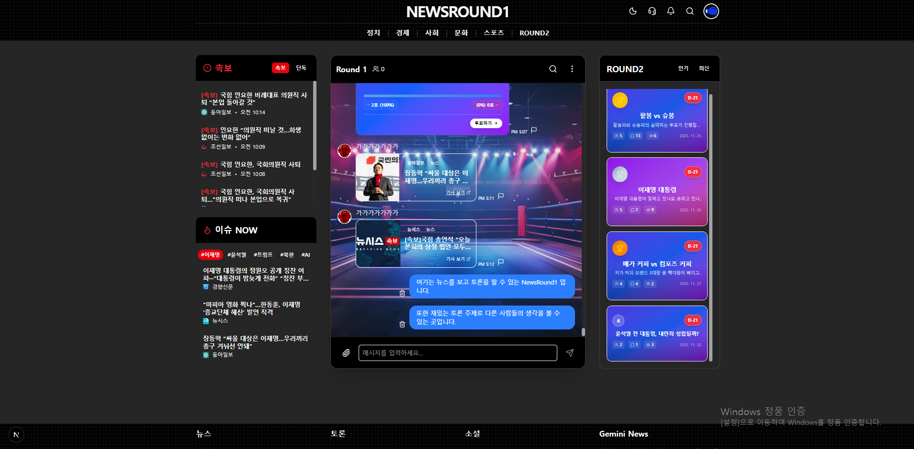
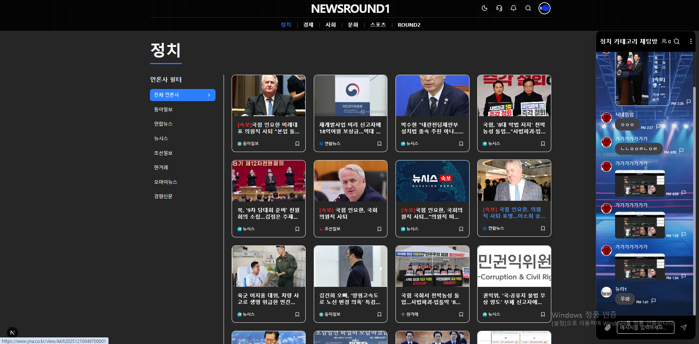
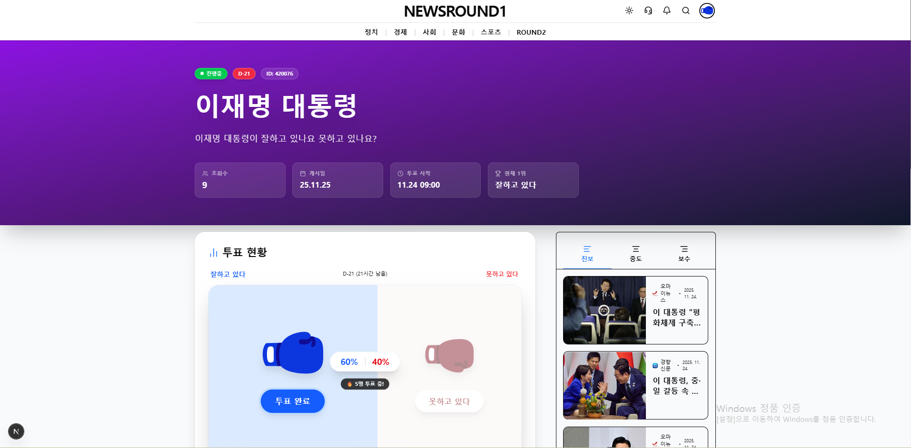
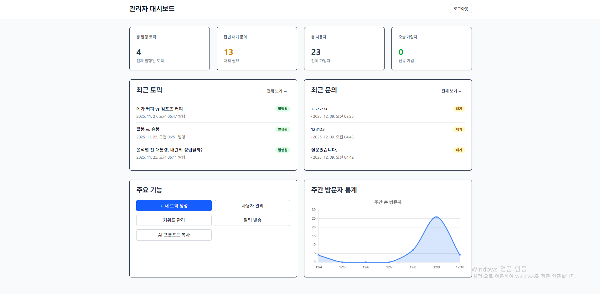

# 뉴스 커뮤니티 플랫폼 (News Community Platform)


### 🛠️ 기술 스택


## 📖 프로젝트 소개

이 프로젝트는 다양한 정치적 성향을 가진 사용자들을 위해 언론사를 분류하여 뉴스를 제공하고, 관련 토픽을 중심으로 소통할 수 있는 **뉴스 커뮤니티 플랫폼**입니다.

이 리포지토리는 **개인 학습 및 포트폴리오용 통합 버전**으로, 백엔드/관리자 프론트엔드/사용자 프론트엔드가 모두 포함되어 있습니다.

## 🚀 빠른 시작

### 📎 주요 링크

- **[🌐 배포된 서비스 바로가기](https://newsround1-git-main-kalims-projects-144eea21.vercel.app/)** ← 클릭하여 실제 서비스 체험
- **[📚 NotebookLM 프로젝트 가이드](https://notebooklm.google.com/notebook/ab93c38c-3d4b-4787-92d7-3b2da5b05fe2)** ← AI 기반 프로젝트 설명 및 Q&A (공유 후 URL 업데이트)

> **💡 Tip**: 위 링크를 통해 프로젝트를 빠르게 파악하실 수 있습니다!

## 📸 주요 기능 미리보기

### 메인 페이지

실시간 속보, 인기 토픽, 트렌딩 키워드를 한눈에 확인할 수 있습니다.



### 카테고리별 뉴스 피드

정치, 경제, 사회 등 카테고리별로 분류된 뉴스를 필터링하여 볼 수 있습니다.



### 토픽 투표 (ROUND2)

진보/중도/보수 관점의 기사를 비교하고 의견을 표명할 수 있습니다.



### 관리자 대시보드

토픽 및 기사 큐레이션, 사용자 관리를 위한 관리자 전용 인터페이스입니다.



---

## 🏗️ 시스템 아키텍처

### 모노레포 구조

이 프로젝트는 하나의 리포지토리에서 세 가지 주요 모듈을 관리합니다.

| 모듈명             | 경로              | 역할                               | 기술 스택               | 로컬 포트 |
| ------------------ | ----------------- | ---------------------------------- | ----------------------- | --------- |
| **Backend**        | `/backend`        | 데이터 수집/가공 및 API 서버       | NestJS, Python (Script) | **3001**  |
| **Admin Frontend** | `/frontend-admin` | 데이터 및 토픽 관리용 대시보드     | React, Vite             | **3000**  |
| **User Frontend**  | `/frontend-user`  | 실제 사용자가 이용하는 서비스 화면 | Next.js (App Router)    | **3002**  |

### 개발 역할 분담

| 모듈               | 담당자     | 역할                                           |
| ------------------ | ---------- | ---------------------------------------------- |
| **Backend**        | **본인**   | API 서버 개발, 데이터 파이프라인 구축, DB 설계 |
| **Admin Frontend** | **본인**   | 관리자 대시보드 개발, 데이터 큐레이션 UI       |
| **User Frontend**  | **협업자** | 사용자 서비스 화면 개발 (Next.js)              |

> **Note**: 본 포트폴리오는 **Backend**와 **Admin Frontend**를 중심으로 작성되었습니다.

### 데이터베이스

- **TiDB Cloud**: MySQL 호환 분산 데이터베이스 사용

---

## 🚀 퀵 스타트 가이드 (Quick Start)

로컬 개발 환경에서 전체 시스템을 구동하는 방법입니다.

### 1. 사전 준비 (Prerequisites)

- [Node.js](https://nodejs.org/) (v22 이상 권장)
- Python 3.8+ (데이터 수집 스크립트 실행 시 필요)

### 2. 백엔드 실행 (Backend)

데이터베이스 연결을 위해 `.env` 파일 설정이 필요합니다.

```bash
cd backend
npm install
npm run start:dev
# 실행 확인: http://localhost:3001/api-docs (Swagger)
```

### 3. 관리자 프론트엔드 실행 (Admin)

```bash
cd frontend-admin
npm install
npm run dev
# 실행 확인: http://localhost:3000
```

### 4. 사용자 프론트엔드 실행 (User)

```bash
cd frontend-user
npm install
npm run dev
# 실행 확인: http://localhost:3002
```

---

## 📂 폴더별 상세 설명

### 1. `backend` (API Server)

- **주요 기능**: 인증, 토픽/기사 관리, 댓글/투표 로직, 배너 및 데이터 분석
- **스크립트 (`/backend/scripts`)**:
  - `rss_collector.py`: 뉴스 RSS 데이터 수집
  - `vector_indexer.py`: 기사 유사도 분석 및 벡터 인덱싱
- **API 문서**: 서버 실행 후 `/api-docs` 접속 시 Swagger 확인 가능
- **상세 가이드**: [Backend README](backend/README.md) 참조

### 2. `frontend-admin` (Management Dashboard)

- **목적**: 서비스 운영자가 컨텐츠를 큐레이션하고 사용자를 관리하는 도구
- **주요 기능**:
  - 대시보드 (방문자 통계 등)
  - 토픽 생성 및 상태 관리
  - 기사 큐레이션 (진보/중도/보수 분류)
  - 회원 및 댓글 관리

### 3. `frontend-user` (User Service Interface)

- **목적**: 일반 사용자가 뉴스를 소비하고 커뮤니티 활동을 하는 웹 애플리케이션
- **디자인**: 반응형 웹 디자인, 다크 모드 지원
- **주요 기능**:
  - 뉴스 피드 및 카테고리별 보기
  - 토픽 투표 및 토론 (채팅)
  - 실시간 인기 검색어 및 속보 확인

---

## 🔗 관련 문서

- [Backend API Endpoints](docs/backend/api_endpoints.md)
- [Troubleshooting Guide](docs/backend/troubleshooting.md)
